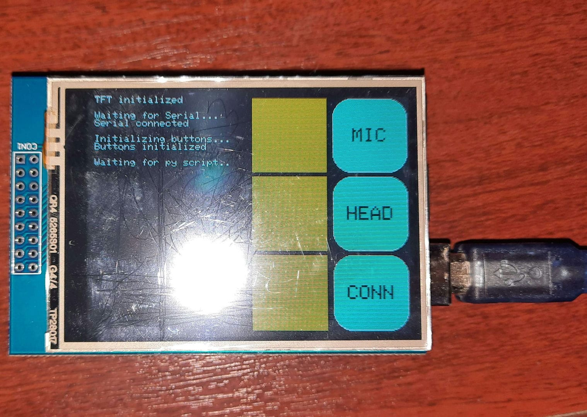

# How to set-up

## Arduino

### Gear

* You will need a 2.8" Arduino TFT Touch Screen Shield, I am using [this one from Elegoo](https://www.amazon.co.uk/gp/product/B01EUVJYME/).
  * You also need an Arduino Uno, I am using [this one from Elegoo](https://www.amazon.co.uk/ELEGOO-Arduino-Arduino-Compatible-Transfer-Operation/dp/B09JWFTZ2V/).
  
* TFT set-up varies greatly between displays, so I recommend following the instructions provided with your display along with [this table](https://github.com/ImpulseAdventure/GUIslice/wiki/Display-Config-Table).
  * Calibrate your display and make sure touch works. The [MCUFRIEND_kbv](https://github.com/prenticedavid/MCUFRIEND_kbv/blob/master/examples/TouchScreen_Calibr_native/TouchScreen_Calibr_native.ino) library provides a fantastic sketch for this that will tell you what settings and pins to use.

### Sketch

* Change to your display settings at the [top of the sketch](./Arduino%20Sketch/Discord_Controller/Discord_Controller.ino).
  
* Install the `Adafruit_GFX`, `MCUFRIEND_kbv`, `TouchScreen` Arduino libraries and/or whatever you need for your display to run.

* Upload the sketch, with a bit of luck you should see this:

You should be good to go, move onto setting up the Python script.

## Python Script

* Make sure you have [Python](https://www.python.org/downloads/) installed, I am using v3.9.2.

* Activate venv and install deps.
  * Go into the [script folder](./Python%20Script/).
  * `python -m venv venv`
  * `venv\Scripts\activate`
  * `pip install -r requirements.txt`
  
* Change `"COM12"` to the port your Arduino is using.

* Run the script.
  * If you set everything up correctly, you should see the TFT display refresh.

You should be good to go, move onto the BetterDiscord plugin.

## BetterDiscord Plugin

> NOTE: Since BetterDiscord is not supported by Discord, it has a good chance of breaking on new Discord updates. If the project isn't working, this is a likely culprit.

* Install [BetterDiscord](https://betterdiscord.app/).

* Move the [plugin](./BetterDiscord%20Plugin/VoiceToWS.plugin.js) to your Plugins folder.

* If all went well, you should some stuff happening in the Python console.

## Troubleshooting

* If the display isn't working, make sure to run some example sketches and check if you put in the right settings at the top of the file.

* Make sure to look at the TFT display, it will tell you when the Python script and/or the BetterDiscord is connected.

* If the Python script never connects, make sure you have the right COM port setup in the script and the display refreshes when you run it.
  
* The BetterDiscord plugin (as of me writing this) doesn't retry the WebSocket connection, you have to manually restart the plugin if Python disconnected or you ran the plugin first.

* Both the Python script and the BetterDiscord plugin output logs that you could use to get more information about the problem, they typically look something like this:
  * For BetterDiscord you have to enable the console in settings.

| **Python** | **Discord** |
| --- | --- |
|  |  |

* Tried turning it off and on again? No, seriously. Preferably in this order: Arduino, Python script, BetterDiscord plugin.
